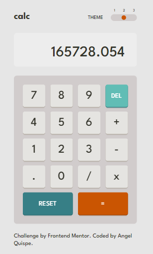
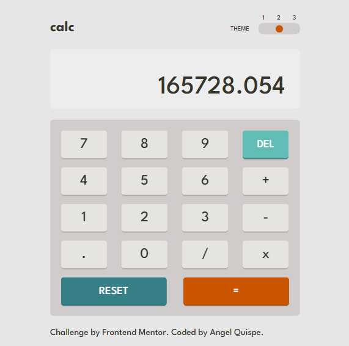
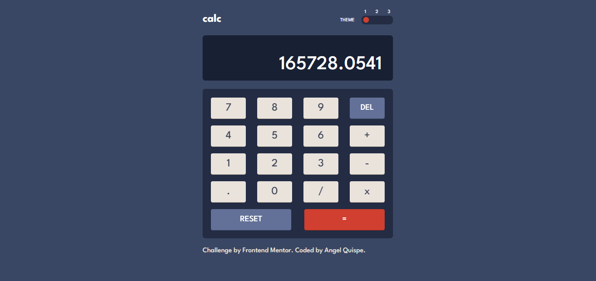
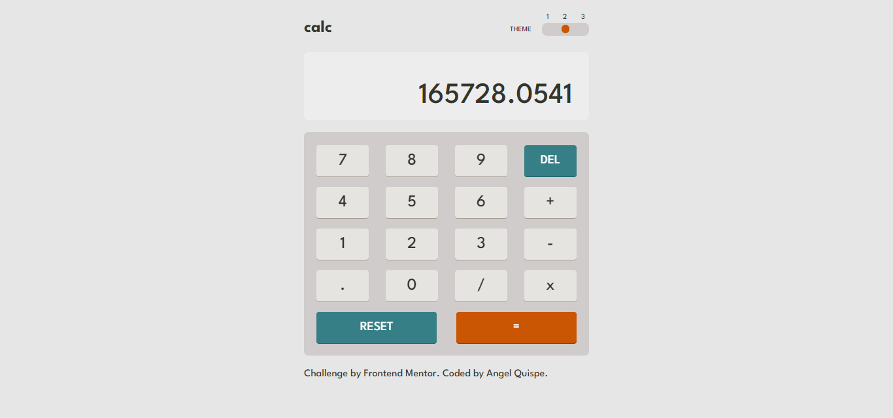
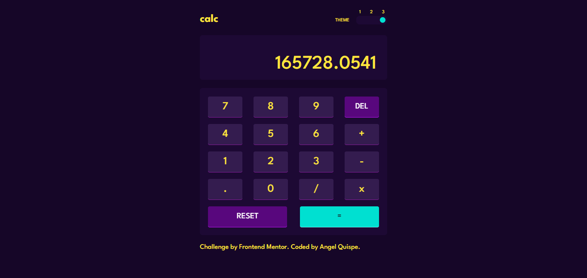
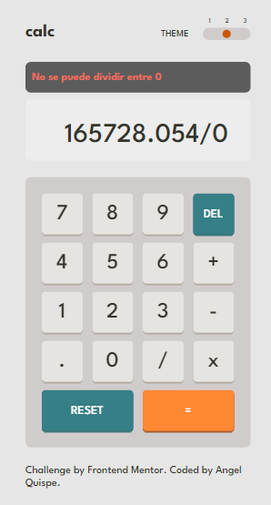

# Frontend Mentor - Advice generator app solution

Esta es uan solución para [Calculator app challenge on Frontend Mentor](https://www.frontendmentor.io/challenges/calculator-app-9lteq5N29).

## Tabla de contenido

- [Descripción general](#descripción-general)
  - [El reto](#el-reto)
  - [Screenshot](#screenshot)
  - [Links](#links)
- [Mi proceso](#mi-proceso)
  - [Construido con](#construido-con)
  - [Aprendizaje](#aprendizaje)
  - [Desarrollo continuo](#desarrollo-continuo)
- [Autor](#autor)
- [Agradecimiento](#agradecimiento)


## Descripción general

### El reto

Los usuarios deben ser capaces de:

- Vea cómo se ajusta el tamaño de los elementos según el tamaño de la pantalla de su dispositivo
- Realizar operaciones matemáticas como suma, resta, multiplicación y división.
- Ajuste el tema de color según su preferencia
- **Bonificación**: verifique su preferencia de tema inicial usando `prefers-color-scheme` y guarde cualquier cambio adicional en el navegador

### Screenshot

**Vista desde un celular**




**Vista desde una tablet**




**Vista desde una laptop**










**Vista desde un celular con error**




### Links

- Solution URL: [Github](https://github.com/AngelQP/calculadora)
- Live Site URL: [Render](https://calculadora-hwee.onrender.com/)

## Mi proceso

### Construido con

- Semantic HTML5 markup
- CSS custom properties
- JS Vanilla
- Vite
- Mobile-first workflow

### Aprendizaje

En esta ruta de aprendizaje al usar Javascript Vanilla me encontre con la duda de como almacenar los datos que el usuario va digitando al igual que las operaciones que deberían realizarse según prioriodad.

Por otro lado, hacer los cambios de temas es algo confuso ya que me decidi realizarlo con un input de tipo range que me permite establecer valores muy facil, sin embargo, estilizar este tipo de input si me fue complicado aunque con el uso de variables la verdad es que se hace más sencillo, aquí dejo un extracto de como lo realice.

```CSS
.range-theme, .range-theme::-webkit-slider-runnable-track, .range-theme::-webkit-slider-thumb {-webkit-appearance: none;}

.range-theme {
  width: 70px;
  height: auto;
  appearance: none;
  border-radius: 10px;
  padding: 3px;
  --theme-Slider: var(--Theme1Red);
  --theme-Slider-hover: var(--Theme1Result);
  cursor: pointer;
}

.range-theme:focus {
  outline: none;
}

.range-theme::-webkit-slider-thumb {
  background-color: var(--theme-Slider);
  width: 12px;
  height: 12px;
  border-radius: 50%;
}

.range-theme::-webkit-slider-thumb:hover {
  background-color: var(--theme-Slider-hover);
}
```

### Desarrollo continuo

Mejorar mi nivel de CSS me ayuda a realizar menos código en maquetación y con mayor consistencia, seguiré con este enfoque para desarrollar más mi potencial de Frontend Developer.

## Autor

- Website - [Angel Quispe](https://angel-qp-github-io.vercel.app/)
- Frontend Mentor - [@angelQuispe](https://www.frontendmentor.io/profile/AngelQP)
- Github - [@AngelQP](https://github.com/AngelQP)

## Agradecimiento

"El éxito se encuentra en lograr cada día un pequeño objetivo"

